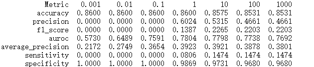
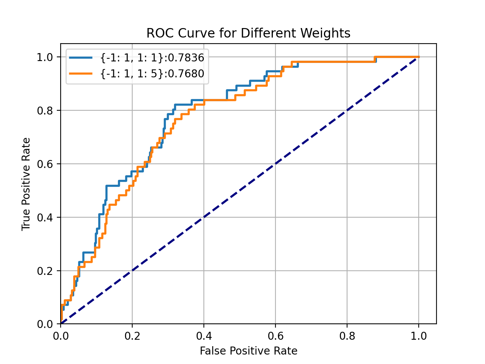
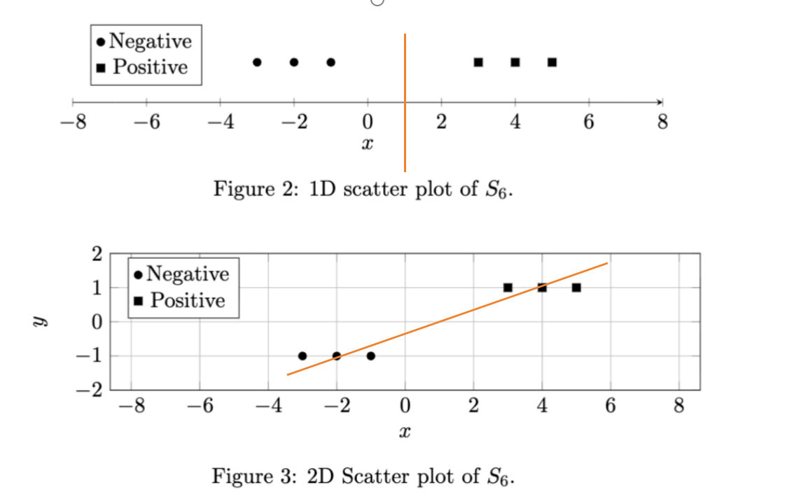
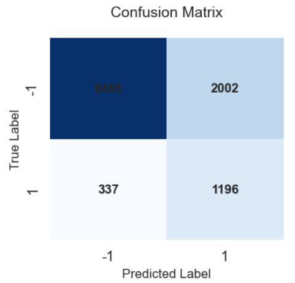

## 1.Feature Extraction
#### (a)
i) In the given dataset, ICUType is represented as 1,2,3,4. But after reading the documentation, we know that ICUType is categorial nominal variable. Thus, this representation falsely imposes an arbitrary order and measurable distance between ICU types, which have no inherent hierarchy.

For a linear classifier, this forces the model to learn a monotonic relationship between the types, crippling its performance and leading to meaningless coefficients.

We can represent this variable by one-hot encoding. And the original value can be represented as following,
1:[1,0,0,0], 
2:[0,1,0,0],
3:[0,0,1,0],
4:[0,0,0,1]

ii)
Limitation: It ignores important patterns like overall trends, stability, duration of changes, and is easily skewed by single measurement errors.

Other summary statistics: Using mean value could be useful.

#### (b)
Assumptions:
- The missing data is Missing Completely At Random (MCAR)
- Imputing with the mean won't significantly distort the feature's distribution
- The missing values don't have meaningful patterns that correlate with other variables

If there are very few missing values, we can simply delete them. Or, we can use median imputation which is more robust. If the missing value is categorial, then we can use mode imputation.

#### (c)
Without normalization, features on larger scales will get larger coefficients, while features on smaller scales will get smaller ones. Regularization penalizes large coefficients more, so it unfairly targets features with large values, even if they are important. Thus, the model becomes biased against features on larger scales.

#### (d)

Table 1: Subset of the data statistics to check

| Feature         | Mean Value | Interquartile Range |
|-----------------|------------|---------------------|
| Age             | 0.6471     | 0.3378              |
| Gender          | 0.5790     | 1.0000              |
| Height          | 0.3722     | 0.0008              |
| ICUType         | 0.5933     | 0.6667              |
| Weight          | 0.2950     | 0.1136              |
| max_ALP         | 0.0717     | 0.0165              |
| max_ALT         | 0.0156     | 0.0137              |
| max_AST         | 0.0157     | 0.0138              |
| max_Albumin     | 0.5053     | 0.0000              |
| max_BUN         | 0.1319     | 0.0979              |
| max_Bilirubin   | 0.0430     | 0.0252              |
| max_Cholesterol | 0.3261     | 0.0000              |
| max_Creatinine  | 0.0649     | 0.0334              |
| max_DiasABP     | 0.3330     | 0.0394              |
| max_Fi02        | 0.7504     | 0.4167              |
| max_GCS         | 0.8772     | 0.2500              |
| max_Glucose     | 0.1389     | 0.0684              |
| max_HC03        | 0.3503     | 0.1389              |
| max_HCT         | 0.3335     | 0.1459              |
| max_HR          | 0.3294     | 0.1835              |
| max_K           | 0.2094     | 0.1014              |
| max_Lactate     | 0.1360     | 0.0498              |
| max_MAP         | 0.3996     | 0.0582              |
| max_Mg          | 0.0415     | 0.0143              |
| max_NIDiasABP   | 0.2995     | 0.1149              |
| max_NIMAP       | 0.3394     | 0.1081              |
| max_NISysABP    | 0.5512     | 0.1087              |
| max_Na          | 0.3550     | 0.0820              |
| max_Pac02       | 0.3362     | 0.1026              |
| max_Pa02        | 0.4671     | 0.3232              |
| max_Platelets   | 0.2016     | 0.1113              |
| max_RespRate    | 0.1719     | 0.0000              |
| max_Sa02        | 0.9419     | 0.0092              |
| max_SysABP      | 0.5436     | 0.0644              |
| max_Temp        | 0.3609     | 0.1538              |
| max_TroponinI   | 0.1938     | 0.0000              |
| max_TroponinT   | 0.0579     | 0.0000              |
| max_Urine       | 0.0781     | 0.0562              |
| max_WBC         | 0.0018     | 0.0006              |
| max_pH          | 0.0048     | 0.0015              |

## 2.
#### (a)
Maintaining class proportions across folds can make each fold accurately reflects the real-world class distribution, preventing biased performance estimates. Thus, it can evaluate generalization performance more accurate.

#### (b)
From the objective function, we can see $\frac{1}{C}$ is the regularization strength. As we increase C:
- Regularization decreases 
- Model complexity increases, feature coefficients can become larger and will have stronger influences on predictions.
- Risk of overfitting increases 

#### (c)

Table 2: Cross-validation performance

| Performance Measure | C      | Penalty | Mean (Min, Max) CV Performance |
|------------------|--------|---------|-------------------------|
| accuracy            | 0.001  | L1      | [0.86, 0.8594, 0.8625]         |
| precision           | 1      | L2      | [0.6024, 0.1667, 1.0]          |
| f1_score            | 10     | L2      | [0.2265, 0.1587, 0.2642]       |
| auroc              | 1      | L2      | [0.7804, 0.7539, 0.8192]       |
| average_precision   | 1      | L2      | [0.3923, 0.2893, 0.4965]       |
| sensitivity         | 10     | L1      | [0.1474, 0.1111, 0.1778]       |
| specificity         | 0.001  | L1      | [1.0, 1.0, 1.0]                |

Since the dataset is imbalanced, and we want to build model to detect more  patients died accurately. Furthermore, we also expect the model have a good precision performance. Therefore, f1-score is recommended. Furthermore, AUROC is another recommended metric because it is best overall measure of model performance across all thresholds.

when do  5-fold cross validation, I fix penalty='L1' and vary C with each metrics. The result is shown in the following picture.  

From the figure, we can summarize that performance will be improved and reach the peak when C increased. Then the performance will be decreased with increasing C. 

#### (d)
In 2(c) part, when penalty='L2', C=1 will maximize AUROC.

Table 3: Test performance for logistic regresion with C and penalty

| Performance Measure | Median | (95% Confidence Interval) |
|---------------------|--------|---------------------------|
| accuracy            | 0.8550 | [0.8225, 0.8900]          |
| precision           | 0.4286 | [0.1331, 0.7143]          |
| f1_score            | 0.1471 | [0.0323, 0.2632]          |
| auroc               | 0.7827 | [0.7196, 0.8374]          |
| average_precision   | 0.3596 | [0.2587, 0.4689]          |
| sensitivity         | 0.0839 | [0.0185, 0.1731]          |
| specificity         | 0.9800 | [0.9634, 0.9942]          |

#### (e)

From the plot, we can see L1 regularization can lead to sparsity solution. When C is quite small, the regularization strength can be very strong and some coefficients tend to be zeros. While L2 regularization doesn't such property and all coefficients are nonzero with varing C.

#### (f)

Table 4: Feature ranked by coefficient magnititude

| Feature Name | Positive Coefficient |
|--------------|----------------------|
| max_Bilirubin | 4.1053             |
| max_BUN       | 2.5931             |
| max_HR        | 1.6193             |
| Age           | 1.5566             |

| Feature Name | Positive Coefficient |
|--------------|----------------------|
| max_GCS      | -2.7041            |
| max_Urine    | -2.0179            |
| max_SaO2     | -0.9237            |
| max_HCO3     | -0.8589            |

#### (g)
A more positive coefficient means that higher values of this feature make death more likely.

Positive coefficients: increase the probability of mortality.
Negative coefficients: decrease the probability of mortality.

A coefficient of zero means the model found no linear relationship between that feature and the log-odds of mortality. That means these features do not influence the prediction of in-hospital mortality.

## 3.
#### 3.1
In this problem, the only difference is negative label setting. Thus, we just prove that 
$$
\begin{align}
loss_{\log}(\bar x,y=1;\bar\theta)=loss_{ce}(\bar x,y'=1;\bar\theta) \tag{1}\\
loss_{\log}(\bar x,y=-1;\bar\theta)=loss_{ce}(\bar x,y'=0;\bar\theta) \tag{2}
\end{align}
$$
For (1)
when $y'=1$,
$$
\begin{aligned}
loss_{ce}(\bar x,y'=1;\bar\theta) &= -\ln \sigma(\bar\theta\cdot \bar x) \\
&= -\ln\frac{1}{1+e^{-\bar\theta\cdot \bar x}}\\
&= \ln(1+e^{-\bar\theta\cdot \bar x})\\
&= loss_{\log}(\bar x,y=1;\bar\theta)
\end{aligned}\\
$$

For (2),
when $y'=0$,
$$
\begin{aligned}
loss_{ce}(\bar x,y'=0;\bar\theta) &= -\ln \Big(1-\sigma(\bar\theta\cdot \bar x) \Big)\\
&= -\ln\Big(1- \frac{1}{1+e^{-\bar\theta\cdot \bar x}}\Big)\\
&= -\ln\frac{e^{-\bar\theta\cdot \bar x}}{1+e^{-\bar\theta\cdot \bar x}}\\
&= \ln\frac{1+e^{-\bar\theta\cdot \bar x}}{e^{-\bar\theta\cdot \bar x}}\\
&=\ln(1+e^{\bar\theta\cdot \bar x})\\
&= loss_{\log}(\bar x,y=-1;\bar\theta)
\end{aligned}\\
$$
Therefore, these two forms of loss function are equivalent.

#### 3.2
#### (a)
When $W_p$ is much greater than $W_n$, the classifier will pay more attention to positive samples (patient died within 30 days). Thus, fewer positive instances will be missed and the decision boundary will shift to favor increased sensitivity for the positive class. But if $W_p$ is too large, it can lead to lower specificity.

#### (b)

Table 5: Test performance with class weights

<table>
  <thead>
    <tr>
      <th colspan="3">Wn = 1, Wp = 50</th>
    </tr>
    <tr>
      <th>Performance Measure</th>
      <th>Median</th>
      <th>(95% Confidence Interval)</th>
    </tr>
  </thead>
  <tbody>
    <tr>
      <td>Accuracy</td>
      <td>0.24</td>
      <td>[0.2025, 0.28]</td>
    </tr>
    <tr>
      <td>Precision</td>
      <td>0.1552</td>
      <td>[0.1173, 0.1935]</td>
    </tr>
    <tr>
      <td>F1-Score</td>
      <td>0.2692</td>
      <td>[0.2113, 0.3247]</td>
    </tr>
    <tr>
      <td>AUROC</td>
      <td>0.7508</td>
      <td>[0.6873, 0.8104]</td>
    </tr>
    <tr>
      <td>Average Precision</td>
      <td>0.3391</td>
      <td>[0.2372, 0.4459]</td>
    </tr>
    <tr>
      <td>Sensitivity</td>
      <td>1.0</td>
      <td>[1.0, 1.0]</td>
    </tr>
    <tr>
      <td>Specificity</td>
      <td>0.1159</td>
      <td>[0.0819, 0.1525]</td>
    </tr>
  </tbody>
</table>

#### (c)
From the table, we know sensitivity and specificity are most affected. AUROC and average precision are least affected. 

Give more weight to positive class, the classifier tried to recognize more samples as positive. Certainly, it will detect more positive samples correctly but it also misclassified negative samples. Thus, the sensitivity metric will experience a significant increase, while the specificity will decrease sharply. 

#### 3.3
#### (a)

#### (b)
We can adjust the prediction threshold. In typical binary classfication, we often set the threshold as 0.5. If the predicted probability is larger than 0.5, then it will be assigned positive label. In this imbalanced data classification, we can lower the threshold such as to 0.3. This can classify more ambiguous cases as positive and increases sensitivity by reducing false negatives, without retraining the model or altering class weights.

## 4.
#### 4.1
##### (a)

##### (b)

Table 6:Testing CV performance for kernel ridge and logistic regression

<table>
  <thead>
    <tr>
      <th colspan="5">C = 1, penalty = L2</th>
    </tr>
    <tr>
      <th rowspan="2">Metric</th>
      <th colspan="2">Logistic Regression</th>
      <th colspan="2">Ridge Regression</th>
    </tr>
    <tr>
      <th>Median</th>
      <th>(95% Confidence Interval)</th>
      <th>Median</th>
      <th>(95% Confidence Interval)</th>
    </tr>
  </thead>
  <tbody>
    <tr>
      <td>Accuracy</td>
      <td>0.8525</td>
      <td>[0.8225, 0.8876]</td>
      <td>0.8675</td>
      <td>[0.8350, 0.9000]</td>
    </tr>
    <tr>
      <td>Precision</td>
      <td>0.4167</td>
      <td>[0.1250, 0.7000]</td>
      <td>0.7143</td>
      <td>[0.3333, 1.0000]</td>
    </tr>
    <tr>
      <td>F1-Score</td>
      <td>0.1420</td>
      <td>[0.0339, 0.2571]</td>
      <td>0.1496</td>
      <td>[0.0357, 0.2910]</td>
    </tr>
    <tr>
      <td>AUROC</td>
      <td>0.7843</td>
      <td>[0.7225, 0.8397]</td>
      <td>0.7597</td>
      <td>[0.6940, 0.8176]</td>
    </tr>
    <tr>
      <td>Average Precision</td>
      <td>0.3586</td>
      <td>[0.2502, 0.4845]</td>
      <td>0.3461</td>
      <td>[0.2400, 0.4573]</td>
    </tr>
    <tr>
      <td>Sensitivity</td>
      <td>0.0851</td>
      <td>[0.0189, 0.1765]</td>
      <td>0.0877</td>
      <td>[0.0217, 0.1755]</td>
    </tr>
    <tr>
      <td>Specificity</td>
      <td>0.9799</td>
      <td>[0.9636, 0.9915]</td>
      <td>0.9943</td>
      <td>[0.9853, 1.0000]</td>
    </tr>
  </tbody>
</table>
From the table, we can see these two approaches don't have large difference in performance. Because the kernel used in ridge regression is linear which also works same as linear classification.

#### 4.2
#### (b)

Table 7: Training  cv performance for γ

| γ     | Mean (Min, Max) CV Performance |
|-------|--------------------------------|
| 0.001 | 0.7384 (0.6856, 0.8001)        |
| 0.01  | 0.7669 (0.7258, 0.8049)        |
| 0.1   | 0.7888 (0.7585, 0.8202)        |
| 1.    | 0.7796 (0.7390, 0.8008)        |
| 10    | 0.7465 (0.7191, 0.7826)        |
| 100   |0.7164 (0.6744, 0.7605)        |

parameter $\gamma$ control the model's complexity. Lower $\gamma$ will lead to smoother and less complex model. While larger $\gamma$ will lead to more complex model. Therefore, the model's cross-validation performance will first increase and then decrease as $\gamma$ increases.

#### (c)

<table>
  <caption><strong>Table 8: Test performance</strong></caption>
  <thead>
    <tr>
      <th colspan="3">C=1 , γ=0.1</th>
    </tr>
    <tr>
      <th>Performance Measure</th>
      <th>Median Performance</th>
      <th>95% Confidence Interval</th>
    </tr>
  </thead>
  <tbody>
    <tr>
      <td>accuracy</td>
      <td>0.865</td>
      <td>[0.8325, 0.8975]</td>
    </tr>
    <tr>
      <td>precision</td>
      <td>0.6667</td>
      <td>[0.2, 1.0]</td>
    </tr>
    <tr>
      <td>f1_score</td>
      <td>0.125</td>
      <td>[0.0303, 0.25]</td>
    </tr>
    <tr>
      <td>auroc</td>
      <td>0.7897</td>
      <td>[0.7283, 0.8421]</td>
    </tr>
    <tr>
      <td>average_precision</td>
      <td>0.369</td>
      <td>[0.2641, 0.4798]</td>
    </tr>
    <tr>
      <td>sensitivity</td>
      <td>0.0661</td>
      <td>[0.0152, 0.1458]</td>
    </tr>
    <tr>
      <td>specificity</td>
      <td>0.9943</td>
      <td>[0.9853, 1.0]</td>
    </tr>
  </tbody>
</table>

#### (d)
Not. When using rbf kernel, the original feature will be mapped into a high dimensional space and we can't report a direct weight for each feature in original input space.

## 5.
Firstly, I do the same workflow as section 1-3, and obtain the following result:
For AUC, best C and penalty are:C=1, penalty='L1'
For f1-score, best C and penalty are: C=1000, penalty='L1'

For AUC(mean,min,max): [0.8062 0.7813 0.8199]
For f1-score(mean,min,max): [0.2773 0.2256 0.3111]

**Feature engineering**
- In the dataset, the type of features can be divided into numerical and catergorical variables. Especially, 'Gender' and 'ICUType' are both catergorical variables. The left are all treated as numerical variables. 
- In section 1-4, we all use maximum value of time-varying variable seqences. In this part, use mean value instead.
- When checking the data, I find there exists some columns with too many missing values. Thus, if one column's ratio of missing value is larger than 0.8, then I drop this column.
- For each time-varying variables, I design a sliding windown with size of 24-hour. In each window, the mean of observations in window will be calculated as a new feature. Therefore, each time-variable will produce two-dimensional features. 
- For missing value in dataframe, if the variable is categorical such as "ICUType", I choose most frequent element to fill in missing value. For numerical columns, adopt average value strategy.
- For scaling and transformation, I also tried StandardScaler, but its performance is slightly behind MinMaxScaler. Therefore, I choose the later.

After completing all steps, the dimensionality of processed dataset is 73.

**Hyper-parameter selection**
In this part, I didn't use the implemented function because it only pay attention to two hyper-parameters C and penalty. Here, I explore four parameters,
"penalty": ['l1','l2'],
"C": [0.01,0.1,1,10,100,1000],
"fit_intercept": [True,False],
"class_weight": [None,'balanced']
I directly call the function `GridSearchCV` in sklearn to tunning these parameter combinations. Finally, the best parameter list are:
{'C': 1, 'class_weight': 'balanced', 'fit_intercept': True, 'penalty': 'l1'}

After hyper-parameter tunning, the 5-fold cross validation results are:
Mean auc score: 0.8381
Mean f1 score: 0.5008
The confusion matrix is

